# Linux Crash Course

## Objectives

- GNU Bourne-Again SHell
- Normal vs Root Users
- Manuals
- Filesystem Navigation and Operation
- Viewing & Editing Files
- Software Installation
- Networking
- Services
- SSH
- curl
- Shutdown / Reboot

### GNU Bourne-Again SHell

The GNU Bourne-Again SHell or BASH is the default shell in many Linux distributions, including Fedora. Start a terminal session to begin.

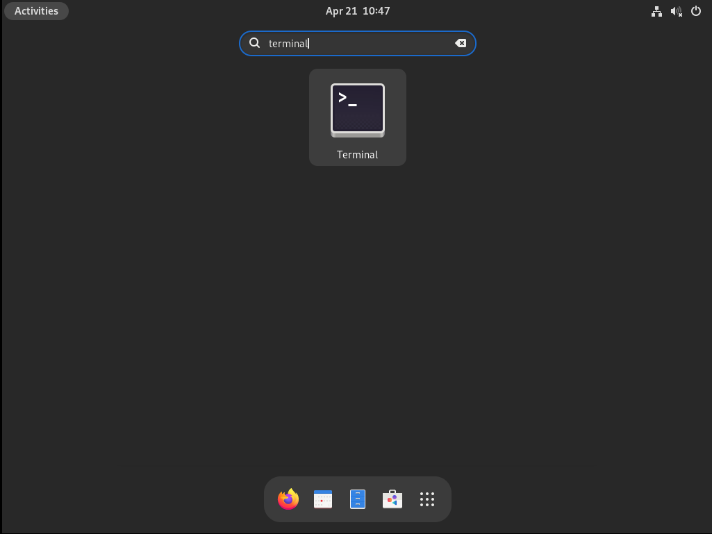

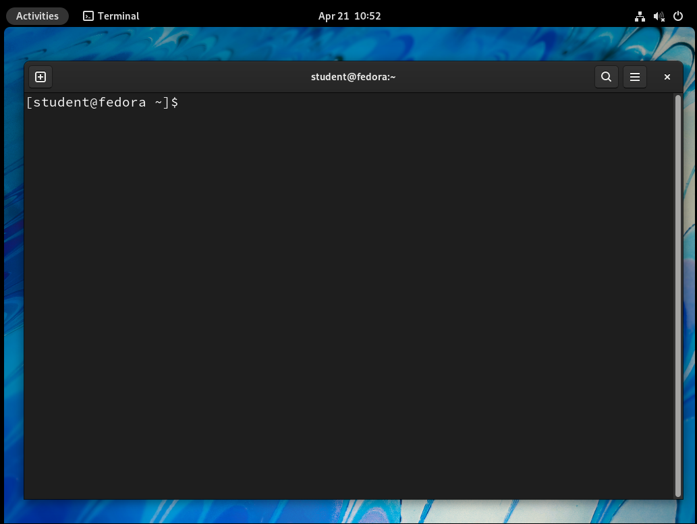

### Normal vs Root Users

The "$" sign in the command prompt indicate that you are currently logged in as a normal user.

You can check your real and effective user and group IDs by issuing the **id** command:

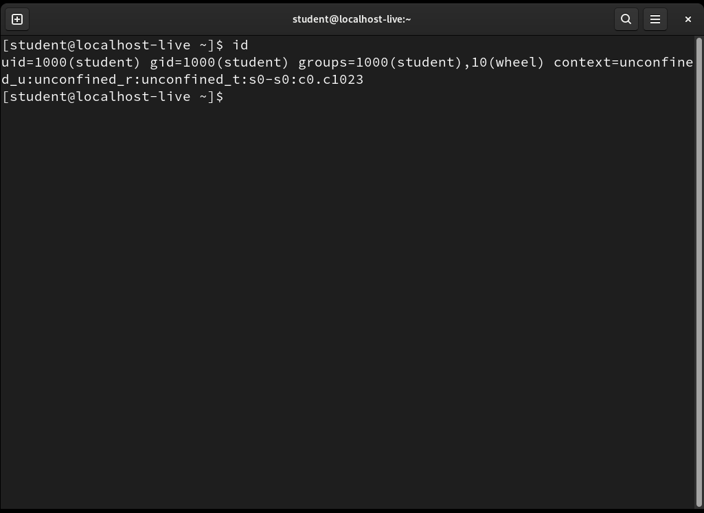

We can switch user to root by using either the **su** command or the **sudo** command. Since we do not have the root password, we will issue the command **sudo bash** to start a bash session as the root user. You will need to supply the password to proceed.

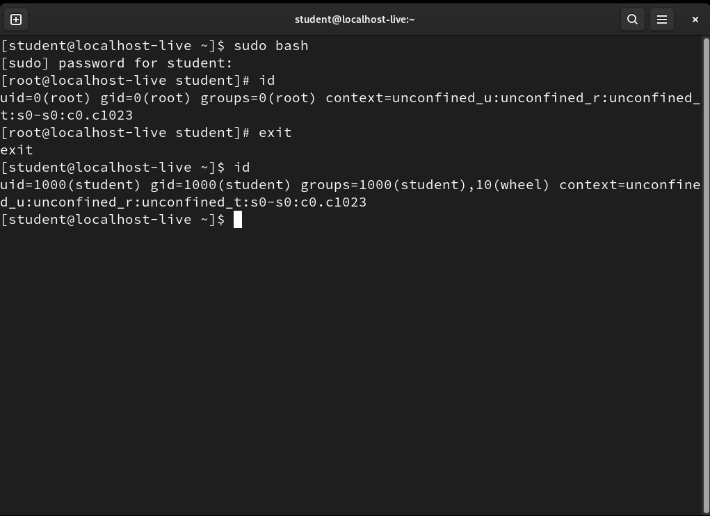

Notice how the command prompt changes to "#" and the output of the **id** command shows that you are now the root user. **WARNING: THE ROOT USER CAN DO ANYTHING ON THE SYSTEM, THEREFORE BE CAREFUL WHEN RUNNING ANY COMMANDS AS THIS USER.**

To return to the normal user, type **exit** and notice that the command prompt changes back to "$".

### Manuals

The **man** command is one of the most important commands that you need to know in Linux. It is an interface to the on-line reference manuals where you can find out detailed information about the command syntax and the different options available.  

The syntax is: **'man \<CMD\>'**

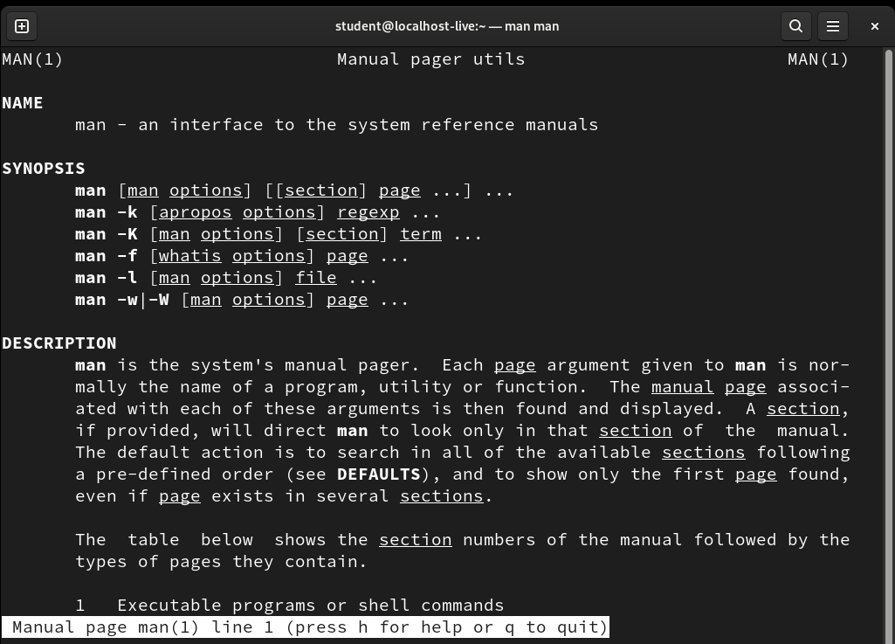

### Filesystem Navigation and Operation

Some of the common filesystem navigation and operation commands include:

- pwd - print the name of the current working directory
- cd - change the working directory
- ls - list directory contents
- cp - copies files and directories
- rm - remove files or directories
- mkdir - make directories

Explore the commands by viewing the respective man pages.

### Viewing & Editing Files

For a new Linux user in a GUI environment, the command **gedit** serves the purpose of editing files well.

In an environment without a GUI interface, the command **vi** can be used to view and edit files. The command **vimtutor** provides a good tutorial to those getting started with **vi**.  (Note that you will need to install additional software before you can use the command vimtutor. We will touch on installing software in the next section)

### Software Installation

The **yum** command is used to install software on a Redhat based Linux system such as Fedora. root privilege is required for software installation and therefore we will need to run sudo for the installation to be successful.

The example below shows the software installation of the **vim-enahced** package to provide the **vimtutor** program.

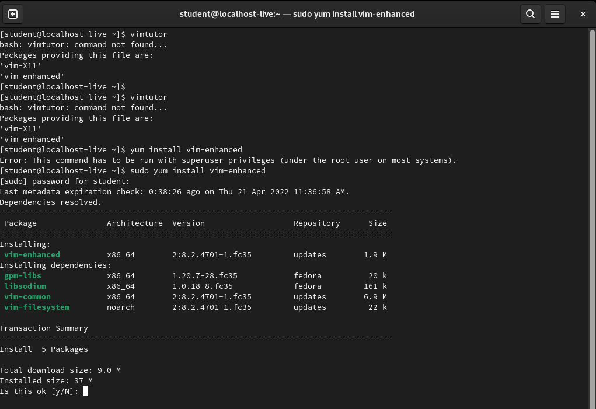

Type 'y' to confirm and install the software package. After the software installation is complete, you will be able to run **vimtutor**

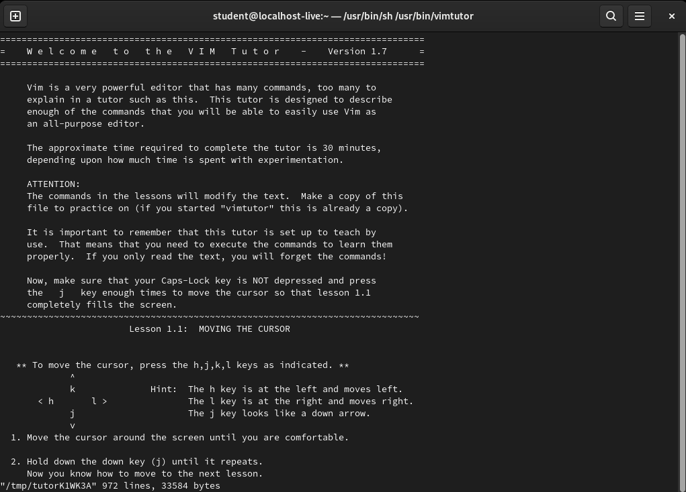

### Networking

You can tell the IP address of your machine by issuing the command **ip address show**

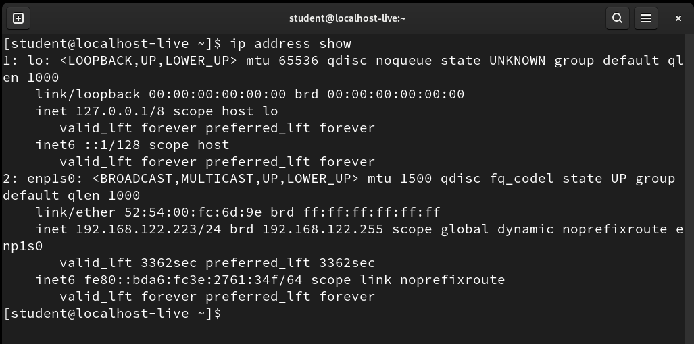

In the output above, it shows the station having an ip address of 192.168.122.223/24 which is a private IP address. All devices accessible on the internet will require a public IP address.

### Services

Some programs like web servers are installed as a service. In this section we will install and run the Apache web server.

The Apache web server is provided by the httpd package. To install the package, run **sudo yum install httpd**

In this case the output shows that the web server is already installed in this system.

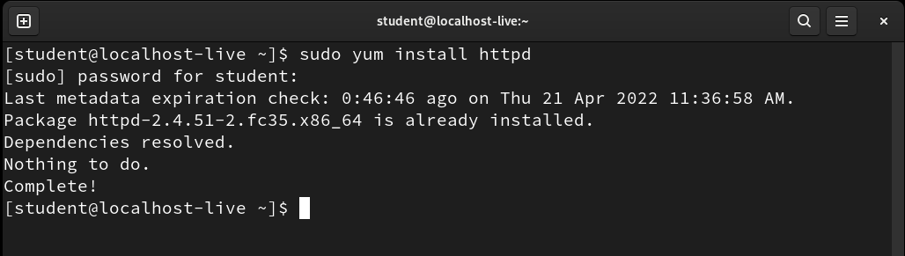

**systemctl** is used to check, start and stop services.

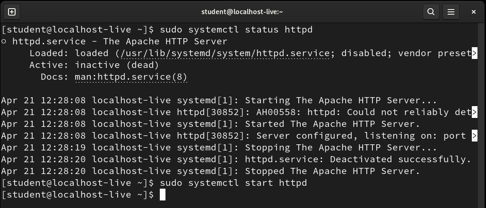

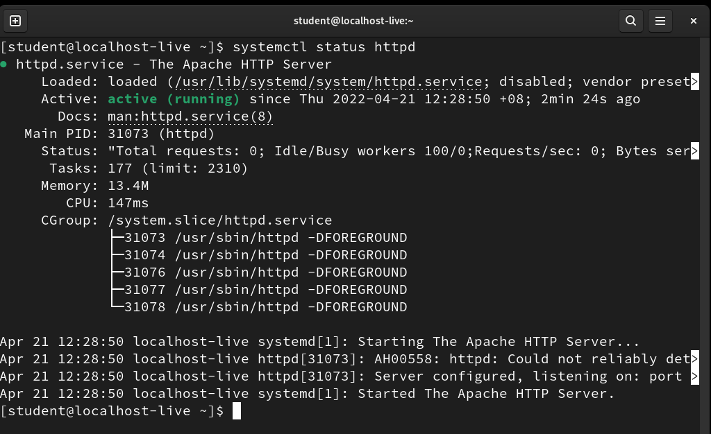

While the service is running, you can access it via a web browser. Open firefox and navigate to the url <http://127.0.0.1>

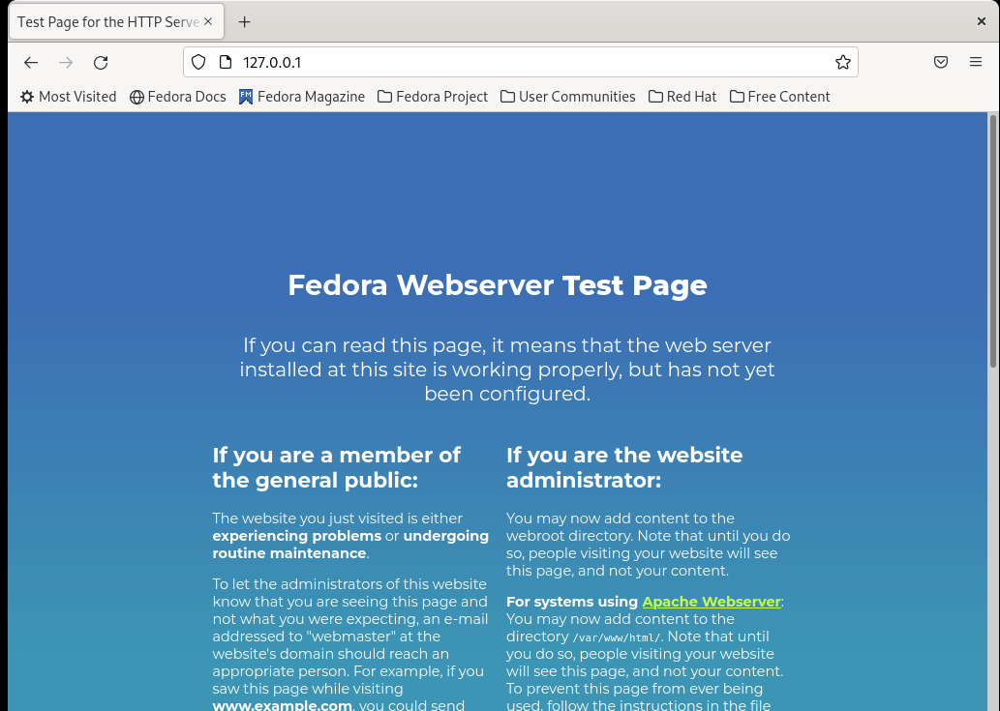

You can stop the service by issuing **sudo systemctl stop httpd**

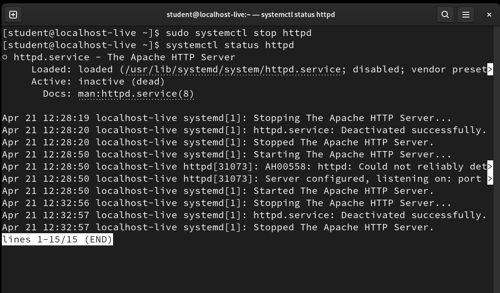

### SSH

SSH or Secure Shell is a protocol which allows secure remote access. This allows a user to login to a server securely over the network.

The service can be started by running the SSH daemon (sshd) using the **systemctl** command.

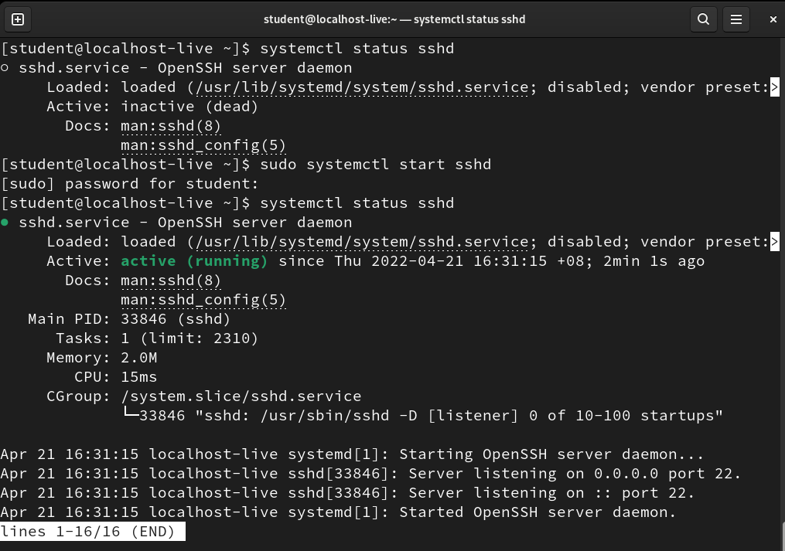

After starting sshd, you will be able to login to the server by using the **ssh** command. The syntax is: **ssh -l *userid* *host***

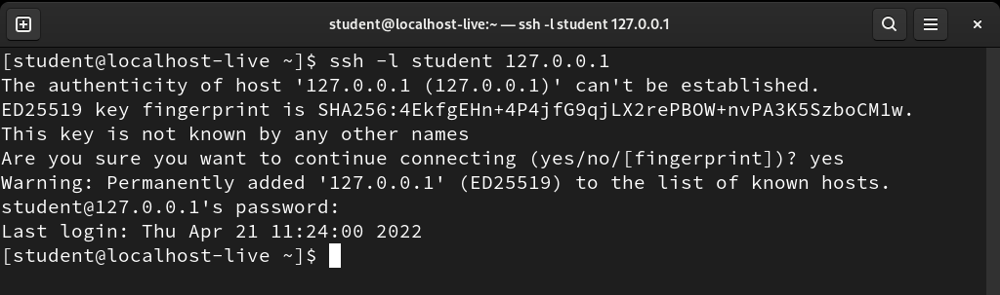

Note that the ip address 127.0.0.1 is a special ip address known as the *loopback* address. We have see earlier that this address is configured on the machine.

### curl

[**curl**](https://curl.se/) is a program which allows the client to tranfer the contents of a URL. It is often used in command lines or scripts to tranfer data.

### Shutdown / Reboot

On Linux systems, you can use the **systemctl** command to shutdown or reboot the machine.

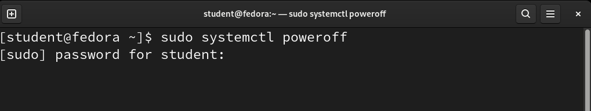

## Resources

- [SANS Institute: Introduction to Linux](https://www.youtube.com/watch?v=bU3ZnRt5qNk)

- [curl Project](https://curl.se/)

- [Linux Fundamentals by Paul Cobbaut](https://linux-training.be/linuxfun.pdf)
