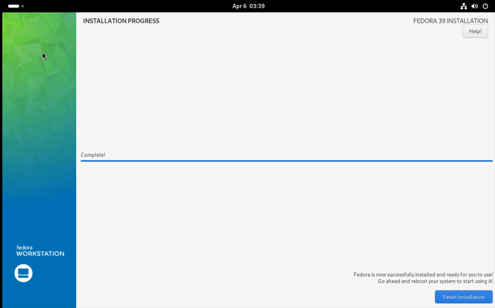
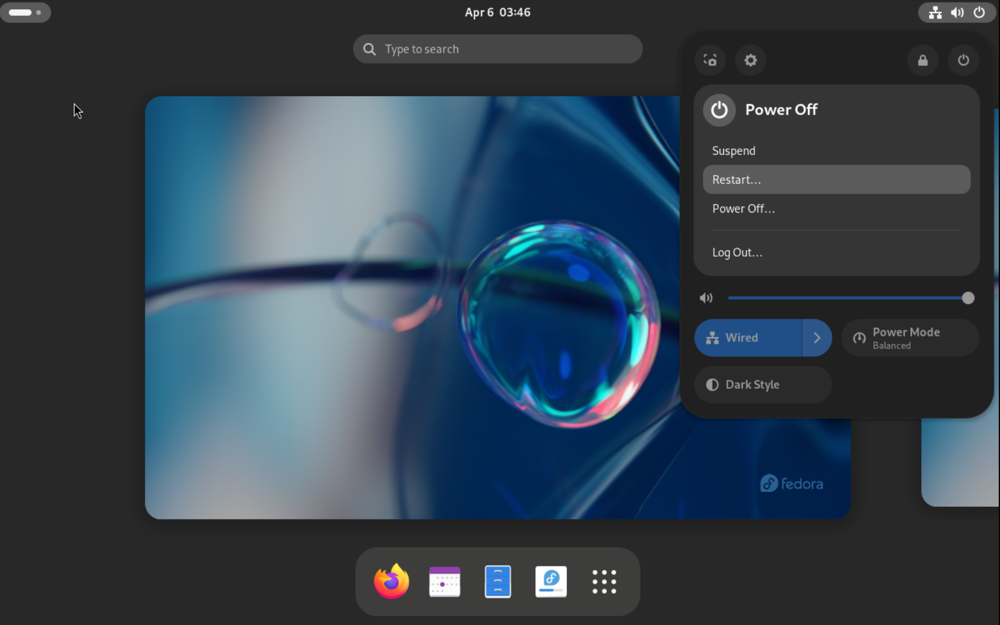
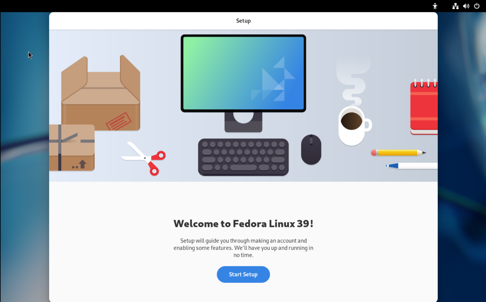
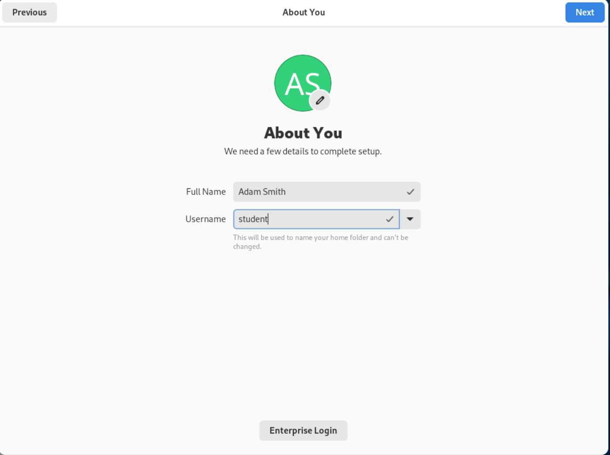

# Virtualization

## Objectives

- Overview of virtualization
- Installation of [Oracle Virtualbox](https://www.virtualbox.org/) hypervisor
- Installation of [Fedora Linux](https://getfedora.org/) as the guest operating system

## What is virtualization

[Virtualization](https://en.wikipedia.org/wiki/Virtualization) is the act of creating a virtual (rather than actual) version of something, including virtual computer hardware platforms, storage devices, and computer network resources.

A piece of software is required to create virtual machines (guest machines) on the physical hardware (host machine).  This piece of software is known as the hypervisor or virtual machine monitor.

## Hypervisors

There are 2 types of hypervisor.

- Type 1: Run directly on the host's hardware, eg Linux KVM, VMware ESXi
- Type 2: Run on top of another operating system, eg Oracle Virtualbox, VMware Workstation Player

## Lab Procedures

TLDR: The steps for this lab is similar to this [linuxhint blogpost](https://linuxhint.com/how-to-install-fedora-workstation-35-on-virtualbox/), except that we will generally be using the latest stable version of all software.  

Detailed documentation can be found below, for reference if necesary:

  1. [Download Oracle Virtualbox](https://www.virtualbox.org/) - Choose the appropriate version for your OS

  2. [Download Fedora Linux](https://getfedora.org/en/workstation/download/) - Get the latest stable version available.

  3. [Install Virtualbox](https://www.virtualbox.org/manual/ch01.html#intro-installing) - Follow the user manual to install Oracle Virtualbox

  4. [Start Virtualbox](https://www.virtualbox.org/manual/ch01.html#intro-starting)

  5. [Creating a new Virtual Machine in Virtualbox](https://www.virtualbox.org/manual/ch01.html#gui-createvm) - Note the following when creating the VM:

      i. Name: Fedora

      ii. Type: Linux

      iii. Hard Disk: 15 GB, dynamically allocated

      iv. Memory: 2 GB

6. [Start VM](https://www.virtualbox.org/manual/ch01.html#intro-starting-vm-first-time) 

7. [Install Fedora Linux](https://docs.fedoraproject.org/en-US/fedora/f36/install-guide/install/Installing_Using_Anaconda/#sect-installation-graphical-mode)

- Fedora Installation notes:
  
  

  - After successful installation of Fedora, you will be presented with a screen similar to the one above.  Remember to change the boot media in your hyperviser to boot from the hard disk instead of the CD-ROM else you will be prompted for installation on reboot.  

  - Restart the system to complete the installation.  

  - You will be presented with a screen similar to the one below for initial setup.  

  - In this screen, setup your username accordingly.  The **Full Name** field is the GECOS which is typically used to store user's name.  The **Username** field is the one that is used by the operating system to identify the user.  Set the full name to your actual name and the username to *student*.  
  
  

  In the following screen, setup a password for this user.  Do not forget the password that you have set.  

## Resources

- [linuxhint: How to Install Fedora Workstation on Virtualbox](https://linuxhint.com/how-to-install-fedora-workstation-35-on-virtualbox/)
- [Wikipedia: Virtualization](https://en.wikipedia.org/wiki/Virtualization)
- [Redhat article: What is virtualization](https://www.redhat.com/en/topics/virtualization)
- [Oracle Virtualbox Documentation](https://www.virtualbox.org/wiki/End-user_documentation)
